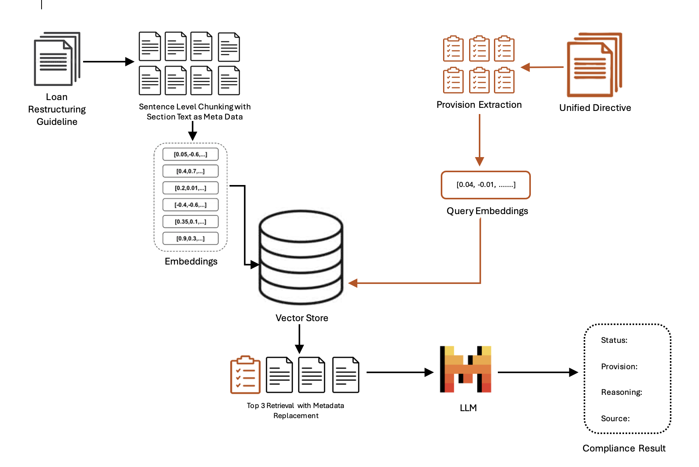

# Automated Compliance Checking
LLMs can streamline compliance checking by analyzing documents of BFIs against regulatory requirements. In this use case, a synthetic *Loan Restructuring and Rescheduling Guideline of XYZ bank* is tested against provisions specified in NRB's Unified Directive 2081. 
