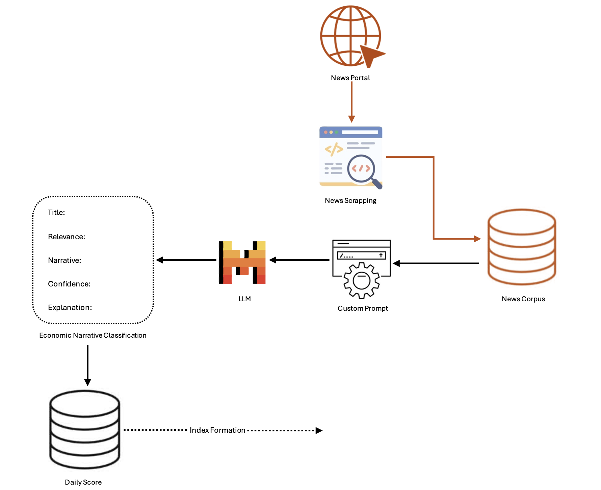

# Economic Narrative Tracker
Leveraging news media, LLM-powered ENT has been proposed which can convert unstructured text into auditable sentiment scores. This ENT will provide actionable insights into emerging trends and could bridge the gap between traditional lagging indicators and forward-looking policymaking.
