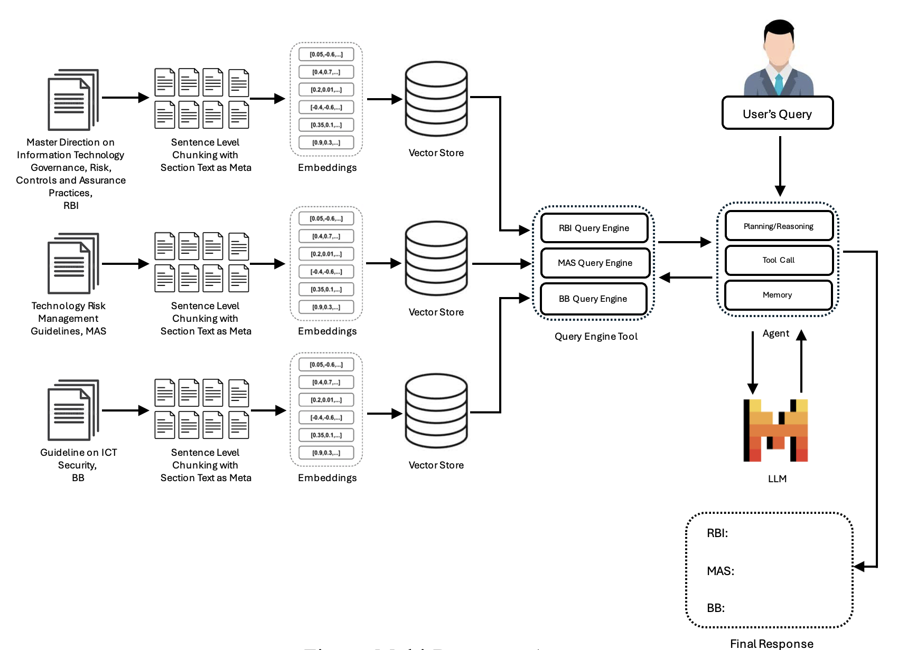

# Cross-Jurisdictional Policy Research
To ensure global best practices, policy formulation often requires comparative analysis across jurisdictions. In this use case, ICT related policy documents from RBI, MAS, and Bangladesh Bank(BB) were used with multi-document agent to explore it.
